## 作者

**风陵：**

github:https://github.com/ForlingTec

CSDN:https://blog.csdn.net/weixin_42518229

**化作尘：**

https://blog.csdn.net/mbs520

## 一、产品介绍

该产品是一款基于USB2.0接口支持多个公司及多种内核的仿真器/编程器，板载了USB HUB、CPLD芯片，集成了DAPLink V2 & STLink V2 & JLink V9.7 & CDC虚拟串口/USB转串口四合一功能，硬件匹配选择的调试器并自动切换输出信号，无需重复更换固件和调试器，真正做到一机多用。

## 二、产品说明

1. 采用沁恒CH334P USB HUB全速率USB2.0集线器，使得同时支持DAPLINK、STLINK、JLINK、USB to USART(默认不焊接)连接
2. 独立3.3V 500mA的LDO稳压电源输出，为目标板提供稳定电源
3. 三大调试器共用一个外部接口，通过CPLD(AG1280Q48)智能检测并切换信号输出
4. 默认自带CDC虚拟串口，也可外接USB转串口芯片(CH340E)，默认NC
5. USB、外部输出接口均连接了静电管，避免静电损坏硬件
6. PCB采用4层双面布局，紧凑整洁，外壳体积小巧，仅40 × 40 × 13mm，外观简洁
7. 使用9P MX2.54带锁扣连接线，并附带清晰的信号标识，不用担心连接不牢固、信号连接错误
8. 每个调试器都有单独的状态指示灯，让用户对产品所处的状态一目了然

## 三、硬件框图

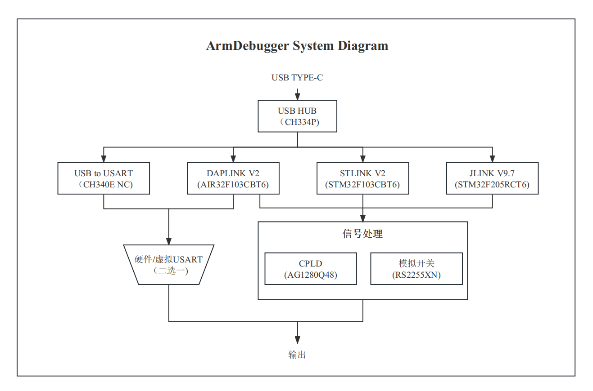

## 四、产品使用

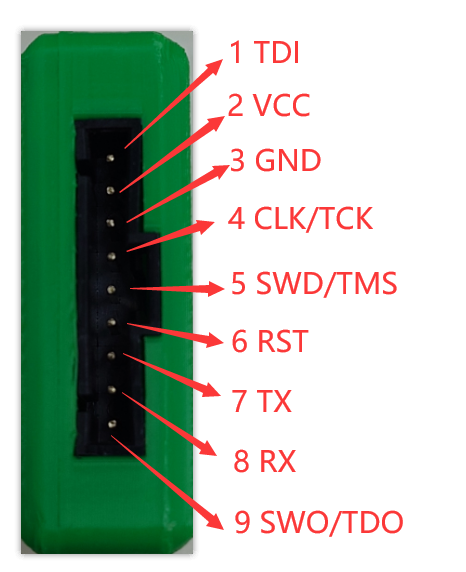

安装完JLINK、STLINK等驱动，一般常用的KEIL/IAR等常用IDE会集成这些驱动程序，插入TYPE-C线，设备管理器显示以下新增设备

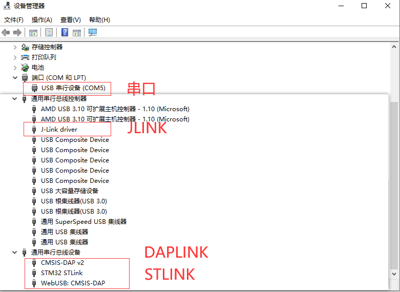

其中在KEIL中，将调试器与板子正常连接，选择调试器类型，会正常识别目标芯片(图中连接的芯片为STM32G0系列)，如下图

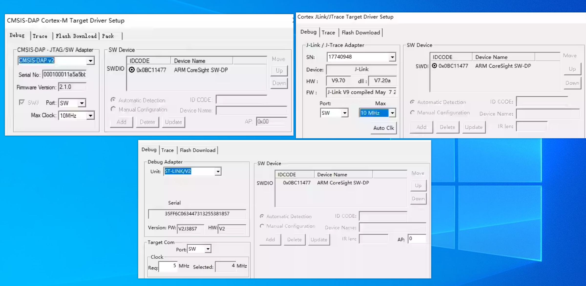

## 五、产品外观

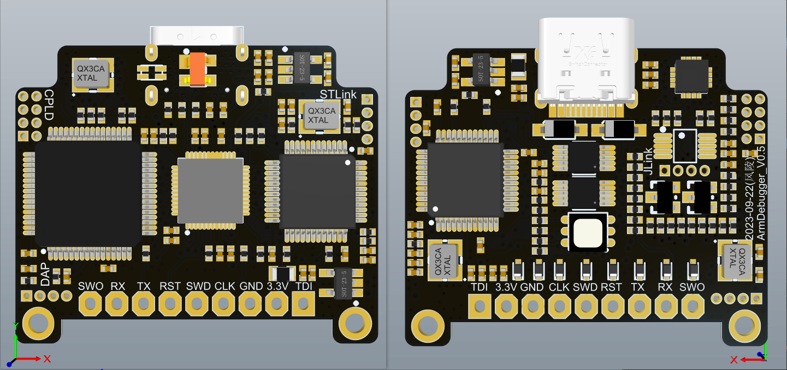

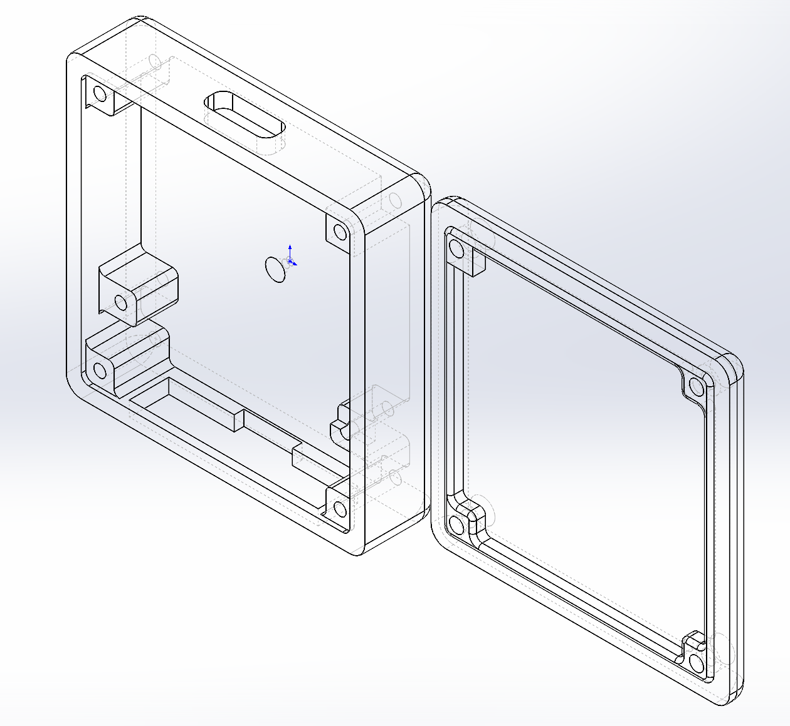

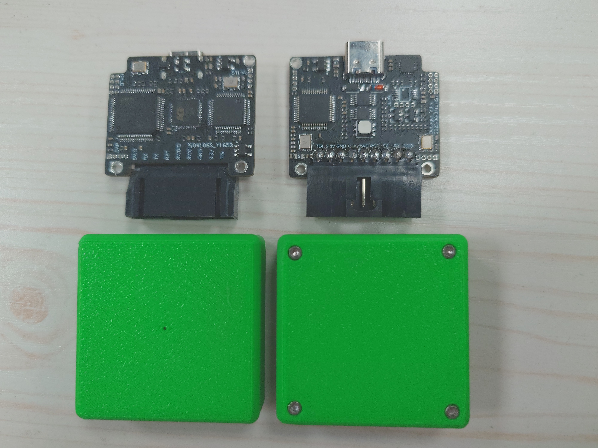

## 六、软硬件设计

STLINK、JLINK均基于立创开源广场已有项目整理而来，DAPLINK基于合宙DAPLINK项目https://wiki.luatos.com/chips/air32f103/daplink.html整理得到。

硬件原理图与PCB工程按照模块划分，分POWER、USB HUB、STLINK、DAPLINK、JLINK、CPLD、PORT共7大模块组成。

软件设计主要是AG1280Q48这颗CPLD对信号的识别与处理，负责检测并切换当前有效的调试器，起到信号路由的作用。

CPLD软件工程用的是Quartus II + Supra混合开发,详情请查看AGM遨格芯官网:http://www.hizyuan.com/ProductDetail/2467472.html

## 七、固件烧录

需要连接TYPE-C线对硬件进行供电，推荐使用STLINK+STM32CubeProgrammer进行下载

**STM32CubeProgrammer加载bin文件，文件路径不能含有中文**

固件下载接口如下：详情请查看原理图与PCB

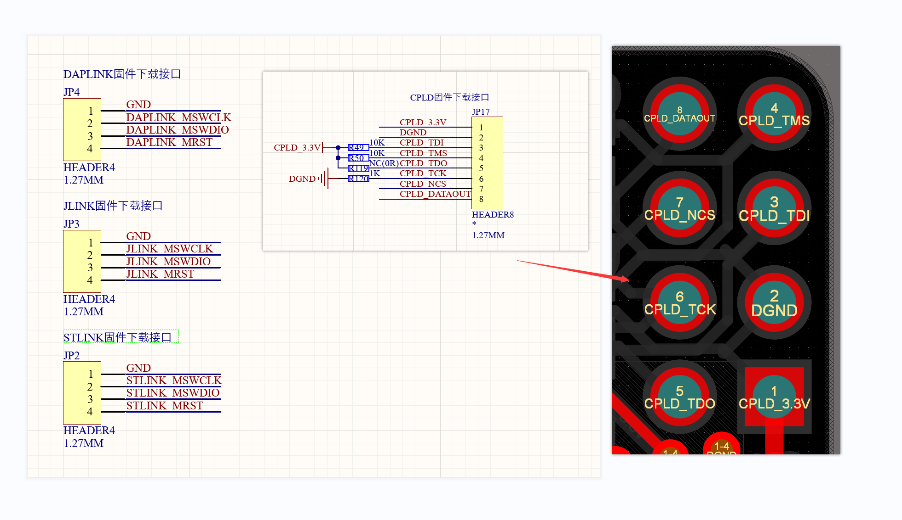

### STLINK

------

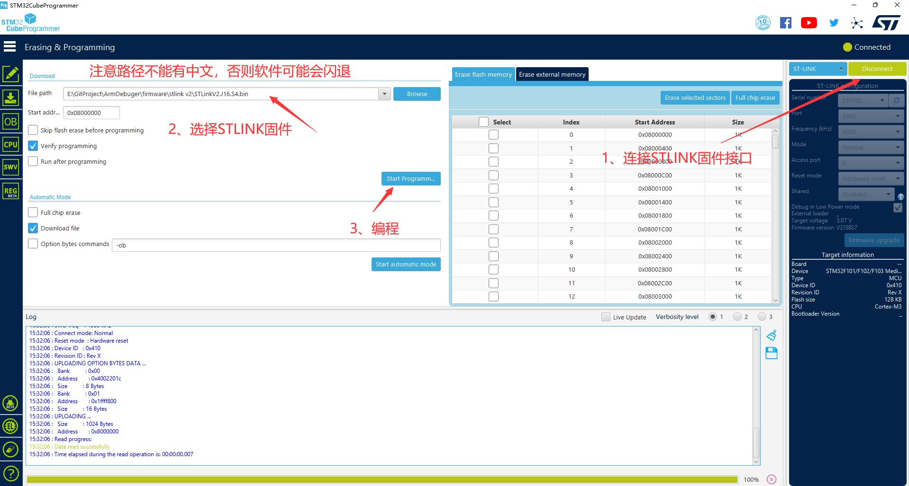

### DAPLINK

------

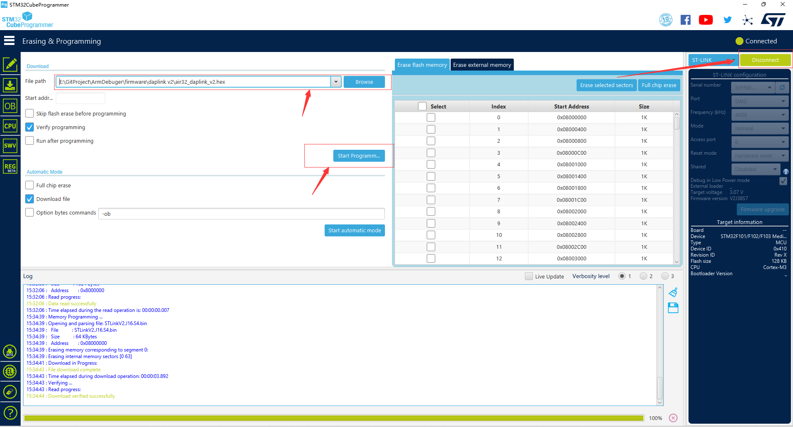

### JLINK

------

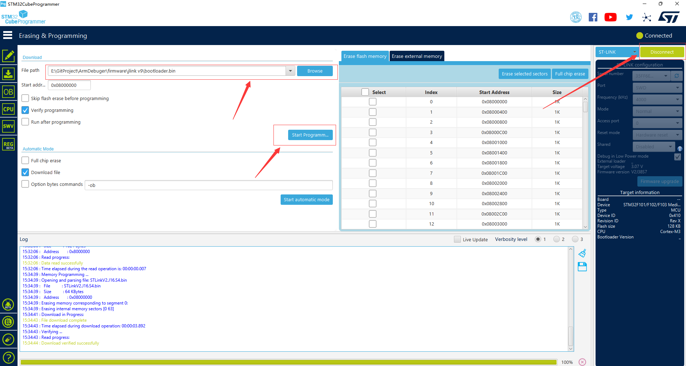

### CPLD

------

1. 用Supra打开软件工程，点击左上角的“file - project - open project - AG1280.proj”，然后点击倒数第二个图标“program into device”打开烧录界面

   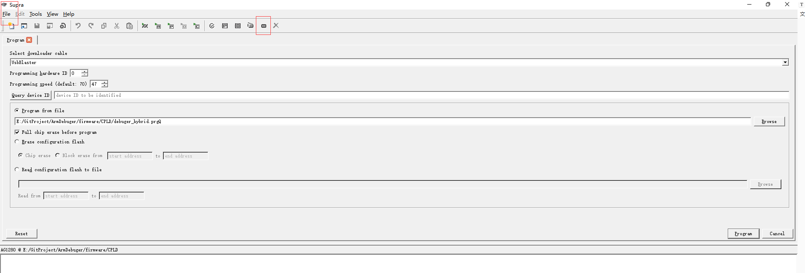

2. 将USB-blaster按照原理图上的信号连接好，按照以下步骤烧录CPLD固件

   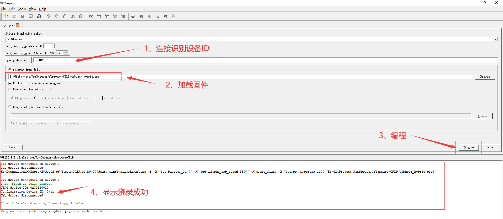

## 八、固件升级、License

步骤七烧录完固件后，重新插拔USB，这时候windows设备管理器就可以正常识别出设备了，可以查看**<<四、产品说明>>**的图片

### STLINK

------

因为步骤七烧录的STLINK的固件很旧，需要用STM32CubeProgrammer更新固件。

**1、重新打开STM32CubeProgrammer软件，进入固件升级界面**

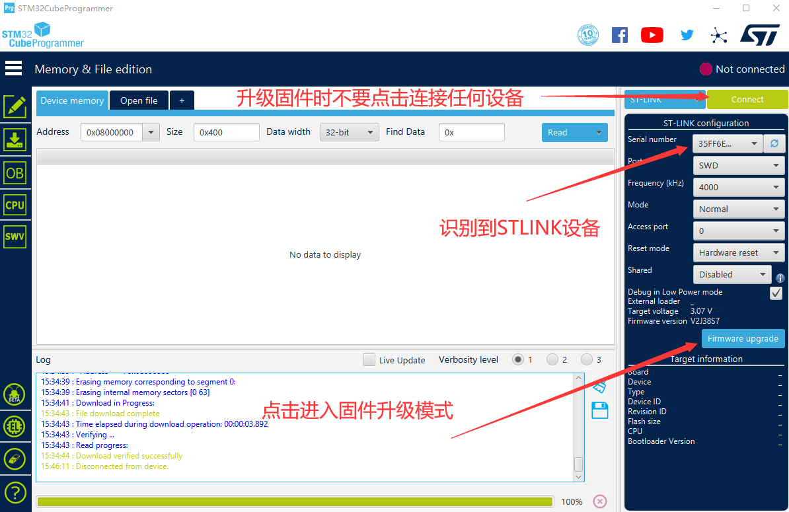

**2、点击“Open in update mode”进入升级模式，识别到版本信息后点击“upgrade”升级按钮，等待升级完毕**

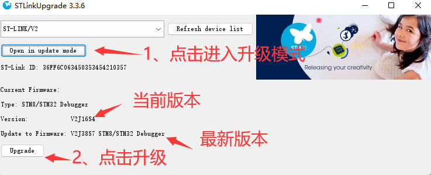

### JLINK

------

**注意事项：JLINK驱动不能用V7.58以上版本，因为修复了盗版的BUG，容易掉固件，推荐用V7.2a及以下驱动版本**

烧录的JLINK固件仅仅是bootloader引导程序，需要用JLINK commander命令行先更新App固件，然后再添加license许可证，步骤如下：

1. 运行"jlink_license_creator.exe"程序

2. 如果没有“JLink_V6.32b.exe”、“JLinkARM.dll”这两个文件，直接点击“打开JLINK”按钮生成

3. 选择硬件版本，推荐用JLINK V9.7

4. 点击“生成”按钮，生成License SN号

   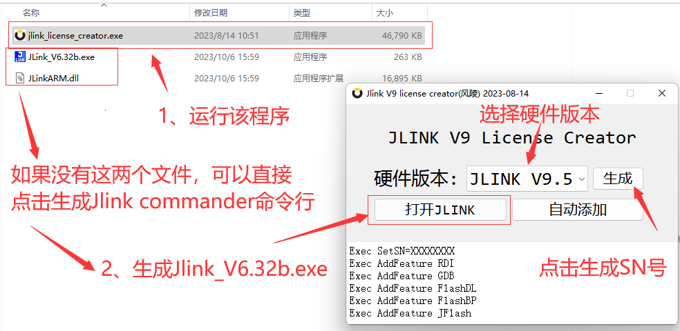

5. 运行“JLink_V6.32b.exe”程序，这时候会更新JLINK App固件，更新App完毕后将生成的S/N号和命令分别一条一条添加进去

   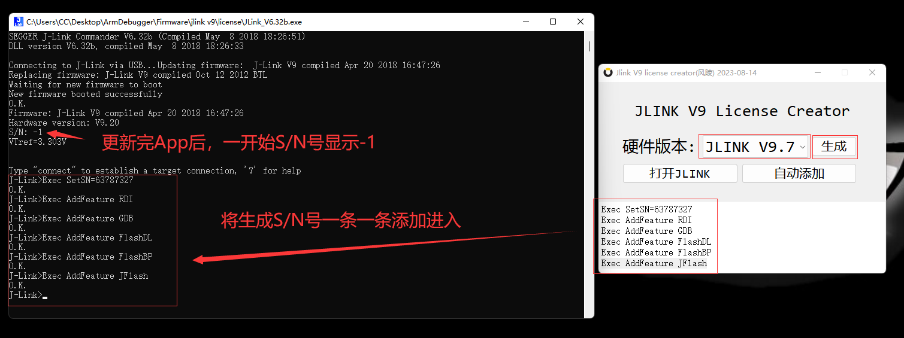

6. 重新插拔USB，并重新打开“JLink_V6.32b.exe”程序，识别到以下信息

   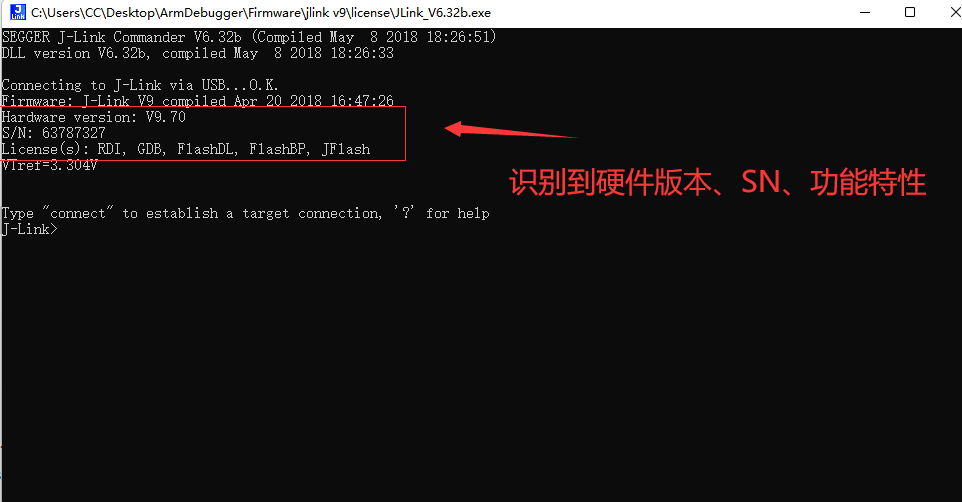

## 九、链接

bilibi哔哩哔哩：

GitHub：https://github.com/ForlingTec/JLINK_DAPLINK_STLINK_USART_Debugger

CSDN：https://blog.csdn.net/weixin_42518229?spm=1000.2115.3001.5343

淘宝链接：https://item.taobao.com/item.htm?id=742546183124

